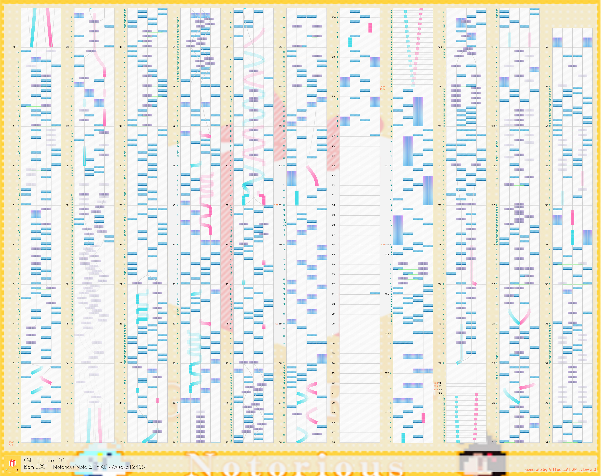

# AffTools

[](#)
[](#)
[](/LICENSE)

A toolset for Arcaea aff files.

- Aff2Preview: 2D chart preview generator
- AffAnalyzer: Analyze aff files

## Aff2Preview

Generate 2D chart preview image by aff file.

Use `System.Drawing.Common` to generate image. However, you can override `AffTools.MyGraphics.GraphicsAdapter` to use your own image library.

Usage:

```csharp
using AffTools.Aff2Preview;

AffRenderer affRenderer = new("assets/2.aff")
{
    Title = "Gift",
    Artist = "Notorious(Nota & TRIAL)",
    Charter = "Misaka12456",
    Side = 0,  // 0:hikari  1:tairitsu  2:dynamix or tempestissimo
    Difficulty = 2,
    Rating = 10.3f,
    Notes = 0, // notes are counted by internal note counter now
    ChartBpm = 200,
    IsMirror = false, // controls whether the chart is mirrored or not
};

// image resource to generate chart preview.
// for each side, please specify the image manually.
affRenderer.LoadResource(
    "assets/note.png",
    "assets/note_hold.png",
    "assets/arc_body.png",
    "assets/base.jpg",  // empty string if unwanted
    "assets/base.jpg"); // empty string if unwanted

var image = affRenderer.Draw();

image?.SaveToPng("output.png");

```

Example output: `assets/2.aff`



## AffAnalyzer

Can analyze aff file and generate chart data.

- Note timing
- Segment timing, bpm and beat per segment
- Aff flaw detection
- Note counting
- Note count at specific timing
- Note density

## LICENSE

Assets: `CC-BY-NC` [Arcaea-Infinity/OpenArcaeaArts](https://github.com/Arcaea-Infinity/OpenArcaeaArts)

`Gift`:  Source: BOFXVI

Aff & cover `616 SB License` Misaka12456 from [Arcaea-Infinity/FanmadeCharts](https://github.com/Arcaea-Infinity/FanmadeCharts)

Part of note counting code modified from [Lolitania/ArcaeaChartNoteCounterLibrary](https://github.com/Lolitania/ArcaeaChartNoteCounterLibrary) under `BSD-3-Clause license`.

Licensed under `616 SB License`.
